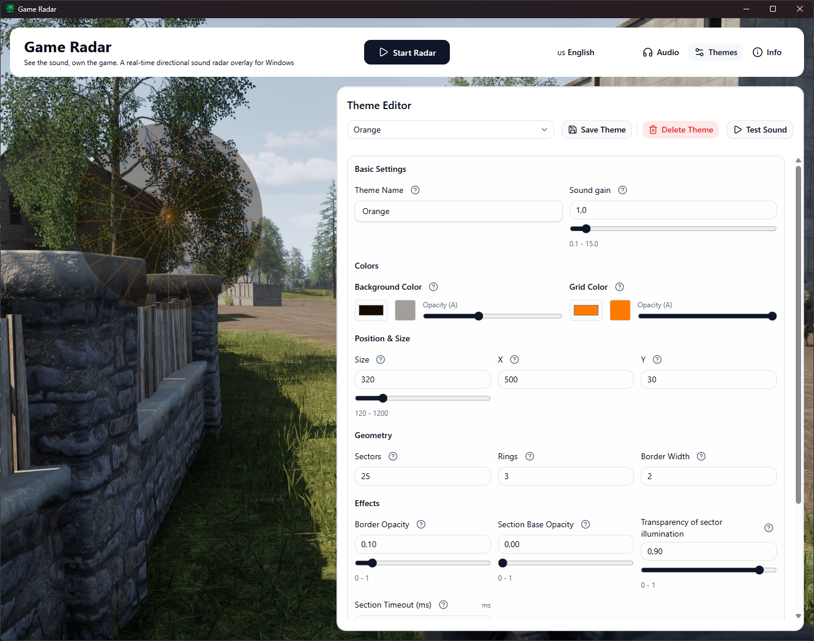

# 🔊 Game Radar

[](README.md)
[](README.ru.md)

> **A real-time directional sound visualizer (sound radar) and game overlay for Windows.**  
> It helps gamers, especially those with hearing loss, “see” 7.1 spatial audio on screen.

  
_[Videodemonstration: Squad](screenshots/demo.mp4)_

## ✨ Features

- 🎮 **Transparent overlay over any game** — does not get in the way of controls; clicks pass through the window.
- 🔊 **Multi-channel audio up to 7.1** — analyzes channels: front L/R, center, side, rear, and more.
- 🧭 **Radar with direction and sound strength** — vector sum of channels yields angle and intensity (`Blip` model).
- 🎨 **Customizable themes** — colors, number of sectors and rings, radar size, and overlay position via the built-in UI.
- ♿ **Accessibility** — make games easier to play without missing important audio cues.
- ⚡ **Low latency** — WASAPI loopback and adaptive polling based on device latency.

## 🖼️ What it looks like


| Settings                                 | Radar in the corner                 |
| ---------------------------------------- | ----------------------------------- |
|  |  |

_Left: theme and behavior settings. Right: a compact overlay during gameplay._

## ⚙️ How it works

1. **Audio capture** — Windows Core Audio (WASAPI) loopback reads peak levels for all channels of the selected device.
2. **Direction analysis (more precisely)** — for 7.1, fixed channel angles are used: FL=330°, FR=30°, FC=0°, BL=210°, BR=150°, SL=270°, SR=90° (LFE is excluded). Channels below `intensity_filter` are discarded as weak. For the remaining channels, the app computes a weighted vector sum `sin(angle)*peak` and `cos(angle)*peak`; then the angle is calculated with `atan2(sinSum, cosSum)` and normalized to `0..359`.
3. **Signal stabilization** — before direction is computed, peaks are averaged over a short history window (6 samples). Final intensity is the resulting vector magnitude `sqrt(cosSum² + sinSum²)` multiplied by `amplifier`.
4. **Visualization** — `Blip` data is sent via Wails events to the Svelte frontend, which draws the radar on Canvas.

## 🚀 Getting started

### System requirements

- **Windows 10 / 11** (WinAPI and WASAPI; other OSes are not tested)
- A sound card with multi-channel support (optional, but recommended for 7.1)
- At least one audio device that supports 7.1
- [Wails installed](https://wails.io/docs/getting-started/installation) (only for building from source)

### Build tool versions

- **Go 1.23+**
- **Wails CLI 2.12+**
- **Node.js LTS** and **npm** (for frontend build)

Check your environment:

```bash
go version
node -v
npm -v
wails doctor
```

### Installation (pre-built binary)

1. Open [Releases](https://github.com/danilsolovyov/game-radar/releases)
2. Download `GameRadar-windows-amd64.zip`
3. Extract to any folder
4. Run `GameRadar.exe`

### Build from source

```bash
git clone https://github.com/danilsolovyov/game-radar.git
cd GameRadar
wails build
```

The executable will be in `build/bin`.

### Run in development mode

```bash
wails dev
```

This starts the backend and frontend with hot reload for faster iteration.

## 🎮 Usage

Select a playback device from the list — the radar starts automatically.

Overlay modes:

- **Radar overlay** — a small window on top of everything; clicks pass through.
- **Main overlay** — fullscreen overlay with the same transparency.

Changing the theme:

- Open settings → **Themes** tab.

Hotkeys (if added):

- Described in the app.

💡 Tip: adjust radar position and size in the theme editor so it does not cover important game UI.

## 🎨 Customization

All visual parameters (colors, size, opacity, number of sectors and rings) are configured in the built-in theme editor.

- No manual file editing is required.
- Advanced users can still edit `config.toml` next to the executable.

## ⚠️ Anti-cheat notice

Some anti-cheat systems (EAC, BattlEye, Vanguard) may falsely flag overlays as cheats.

Game Radar **does not**:

- access game memory;
- inject DLLs;
- emulate input.

The app only listens to audio (WASAPI) and draws a transparent window. Use at your own risk in online games.

For game developers / anti-cheat vendors: if you want to whitelist Game Radar, contact me (see contacts below).

## 🎧 Setting up virtual 7.1 audio for Game Radar

Game Radar requires multi‑channel (7.1) audio. If your headphones or speakers don't support 7.1, you can create a virtual multi‑channel device using free software.

### 🏆 Recommended: SteelSeries GG (Sonar)

**SteelSeries GG** is a free application with an intuitive interface. It creates a virtual 7.1 device in a few clicks and works with any headphones.

**Steps:**

1. Download and install [SteelSeries GG](https://steelseries.com/gg).
2. Launch the app, in the sidebar select **Sonar**.
3. In the **Game** tab, click **"Enable Sonar"** (or toggle it on). A virtual device `SteelSeries Sonar - Gaming` will be created.
4. In Windows Sound settings (right‑click the speaker icon → **Sounds** → **Playback** tab), select **`SteelSeries Sonar - Gaming`** and click **"Set Default"**.
5. In Sonar settings, choose the **"Game"** profile and make sure **7.1 Surround** is enabled (usually on by default).

Done! Game Radar will now receive multi‑channel audio. Optionally, set other apps to output to `SteelSeries Sonar - Media` to keep them separate.

### 🔧 Alternatives

If SteelSeries GG isn't an option, try:

#### **VB-Cable (free)**

- Download from [vb-audio.com/Cable](https://vb-audio.com/Cable/).
- Install, then set **CABLE Input** as the default playback device.
- In the **Recording** tab, open **CABLE Output** properties → **Listen** tab → check **"Listen to this device"** and select your real speakers/headphones.
- Games will output to the virtual cable, and you will hear them through your headphones.

### ⚠️ Does NOT work: Windows Sonic (built‑in)

Windows Sonic for Headphones is a built‑in virtual surround technology. However, it **does NOT create a separate multi‑channel audio device** exposed via WASAPI. Game Radar will only see a stereo stream, not 7.1.

To use Game Radar, please choose one of the methods above (SteelSeries GG or VB‑Cable). Windows Sonic is **not compatible** with the radar.

## 🧰 Troubleshooting

- **Radar does not react to sound**: check that the correct playback device is selected in the app and that audio is actually playing on it.
- **No direction, only weak activity**: make sure your source outputs real 7.1 multi-channel audio, not stereo.
- **Overlay is not visible in game**: switch overlay mode and check whether anti-cheat or fullscreen exclusive mode is blocking it.
- **High latency or stutter**: try another audio device and reduce system load (browser tabs, recording, streaming).

## 🔐 Permissions and safety

- The app normally **does not require Administrator mode**.
- If a game/system blocks overlays, try running as Administrator only as a diagnostic step.
- Game Radar **does not** read game memory, inject DLLs, or emulate input.

## 🗂️ `config.toml` quick reference

Key settings:

- `language` — UI language (`ru`/`en`).
- `radar.theme_name` — active theme.
- `radar.device_speakers_id` — selected playback device ID.
- `radar.intensity_filter` — weak signal cutoff threshold (higher value = more low-intensity signals are ignored).
- `radar.amplifier` — global sensitivity multiplier.
- `themes.<name>.size`, `pos_x`, `pos_y` — radar size and position.
- `themes.<name>.section_count`, `ring_count` — sectors and rings count.
- `logs.*` — log path, levels, and rotation.

## 🔒 Privacy

- The app works locally: it analyzes only the selected device audio stream and draws an overlay.
- Audio data is not sent to external services for processing.

## ❤️ Support the project

Game Radar is free and open source. If you find it useful, you can support development.

### 🇷🇺 For users in Russia

- **Donate.Stream** (cards, SBP): <https://donate.stream/soldan-gameradar>

### 🌍 For users in other countries

**Cryptocurrency (no registration, no middleman):**

| Currency           | Network / token | Address                                       | Trust Wallet (deeplink)                                                                                                                                                  |
| ------------------ | --------------- | --------------------------------------------- | ------------------------------------------------------------------------------------------------------------------------------------------------------------------------ |
| USDT (recommended) | TRC20           | `TBxkDaADAbVk2VH3o3pTYamnnhCN3dSR1R`          | [Send USDT (TRC20)](https://link.trustwallet.com/send?coin=195&address=TBxkDaADAbVk2VH3o3pTYamnnhCN3dSR1R&token_id=TR7NHqjeKQxGTCi8q8ZY4pL8otSzgjLj6t)                   |
| USDC               | Polygon         | `0x6ceBb4a1EC0b50C3C68C8F5A09aA2ae4c944c4e0`  | [Send USDC (Polygon)](https://link.trustwallet.com/send?coin=966&address=0x6ceBb4a1EC0b50C3C68C8F5A09aA2ae4c944c4e0&token_id=0x3c499c542cEF5E3811e1192ce70d8cC03d5c3359) |
| ETH                | Ethereum        | `0x6ceBb4a1EC0b50C3C68C8F5A09aA2ae4c944c4e0`  | [Send ETH](https://link.trustwallet.com/send?coin=60&address=0x6ceBb4a1EC0b50C3C68C8F5A09aA2ae4c944c4e0)                                                                 |
| Bitcoin            | BTC             | `bc1qs3svtnv04tl23fyweq34l0jpny2ymftrv7tad9`  | [Send BTC](https://link.trustwallet.com/send?coin=0&address=bc1qs3svtnv04tl23fyweq34l0jpny2ymftrv7tad9)                                                                  |
| Litecoin           | LTC             | `ltc1qf7de8mtdeczmv8vz97u7ylfz8kh06ejnxhrczs` | [Send LTC](https://link.trustwallet.com/send?coin=2&address=ltc1qf7de8mtdeczmv8vz97u7ylfz8kh06ejnxhrczs)                                                                 |

**CryptoBot (Telegram, if you prefer a bot):** [Send via CryptoBot](https://t.me/send?start=IVGukNPxmSM0)

### 🔁 If one method does not work

If one option is unavailable in your region, use another from the list above (for example, direct USDT TRC20).

All donations go toward maintenance, bug fixes, and new features.

## 🖥️ Future plans

- Hotkey toggle (enable/disable)
- Automatic theme switching depending on the game
- macOS and Linux versions
- More built-in themes

## 📜 License

Distributed under the MIT License. See the LICENSE file for details.

## 🙏 Acknowledgements

- [Wails](https://wails.io/) — desktop framework
- [go-wca](https://github.com/moutend/go-wca) — Windows Core Audio bindings
- [lxn/win](https://github.com/lxn/win) — WinAPI helpers
- [Svelte](https://svelte.dev/) & [HTML Canvas API](https://developer.mozilla.org/en-US/docs/Web/API/Canvas_API) — frontend

## ❓ Questions and suggestions

Questions or suggestions? Open an issue or join the Telegram chat.

- [Open issue](https://github.com/danilsolovyov/game-radar/issues)
- [Join Telegram chat](https://t.me/game_radar_chat)

---

Documentation workflow: `README.ru.md` is the source of truth, and `README.md` is synchronized after updates.
