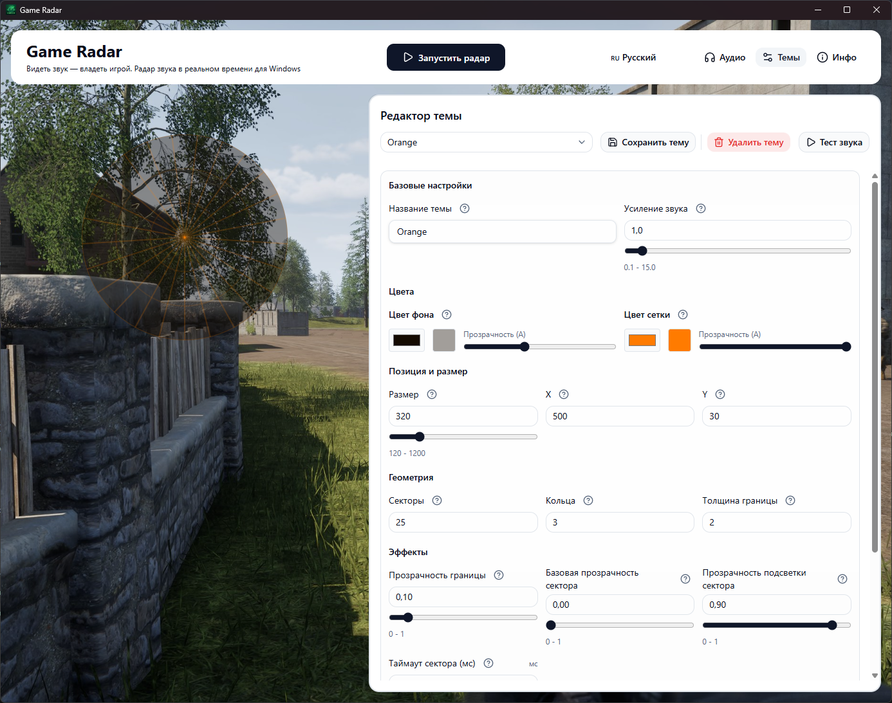
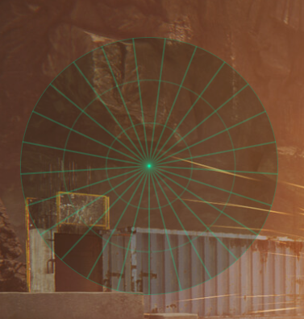

# 🔊 Game Radar

[](README.md)
[](README.ru.md)

> **Визуализатор направленного звука в реальном времени (звуковой радар) и игровой оверлей для Windows.**
> Помогает геймерам, особенно слабослышащим, «видеть» пространственное звучание 7.1 прямо на экране.

  
_[Видеодемонстрация: Squad](screenshots/demo.mp4)_

## ✨ Возможности

- 🎮 **Прозрачный оверлей поверх любой игры** — не мешает управлению, клики проходят сквозь окно.
- 🔊 **Поддержка многоканального звука до 7.1** — анализирует каналы: передние L/R, центр, сайд, тыловые и т.д.
- 🧭 **Радар с направлением и силой звука** — по векторной сумме каналов вычисляется угол и интенсивность (модель `Blip`).
- 🎨 **Настраиваемые темы** — меняйте цвета, количество секторов и колец, размер радара, позицию оверлея через встроенный UI.
- ♿ **Помощь людям с нарушением слуха** — делайте игры доступнее, не пропуская важные звуковые сигналы.
- ⚡ **Низкая задержка** — использует WASAPI loopback и адаптивный интервал опроса с учетом латентности устройства.

## 🖼️ Как это выглядит


| Настройки                                 | Радар в углу                        |
| ----------------------------------------- | ----------------------------------- |
|  |  |

_Слева: настройки темы и поведения. Справа: компактный оверлей во время игры._

## ⚙️ Как это работает

1. **Захват звука** — через Windows Core Audio (WASAPI) в режиме петли (loopback) считываются пиковые уровни всех каналов выбранного устройства.
2. **Анализ направления (точнее)** — для 7.1 используются фиксированные углы каналов: FL=330°, FR=30°, FC=0°, BL=210°, BR=150°, SL=270°, SR=90° (LFE исключается). Каналы с уровнем ниже `intensity_filter` отбрасываются как слабые. Для оставшихся каналов считается взвешенная векторная сумма `sin(angle)*peak` и `cos(angle)*peak`; затем угол вычисляется как `atan2(sinSum, cosSum)` и нормализуется в диапазон `0..359`.
3. **Стабилизация сигнала** — перед расчетом берется усреднение по короткой истории (6 сэмплов), а итоговая интенсивность равна длине результирующего вектора `sqrt(cosSum² + sinSum²)` с множителем `amplifier`.
4. **Визуализация** — данные (`Blip`) отправляются через события Wails во фронтенд на Svelte, который рисует радар на Canvas.

## 🚀 Начало работы

### Системные требования

- **Windows 10 / 11** (используется WinAPI и WASAPI, поддержка других ОС не проверялась)
- Звуковая карта с поддержкой многоканального звука (опционально, но для 7.1 желательна)
- Хотя бы одно аудиоустройство с поддержкой 7.1
- [Установленный Wails](https://wails.io/docs/getting-started/installation) (только для сборки из исходников)

### Версии инструментов для сборки

- **Go 1.23+**
- **Wails CLI 2.12+**
- **Node.js LTS** и **npm** (для сборки фронтенда)

Проверить окружение:

```bash
go version
node -v
npm -v
wails doctor
```

### Установка (готовый бинарник)

1. Перейдите в раздел [Releases](https://github.com/danilsolovyov/game-radar/releases)
2. Скачайте `GameRadar-windows-amd64.zip`
3. Распакуйте в любую папку
4. Запустите `GameRadar.exe`

### Сборка из исходников

```bash
git clone https://github.com/danilsolovyov/game-radar.git
cd GameRadar
wails build
```

Готовый исполняемый файл появится в папке `build/bin`.

### Запуск в режиме разработки

```bash
wails dev
```

Команда запускает backend и frontend с hot reload для быстрой итерации.

## 🎮 Использование

Выберите аудиоустройство в выпадающем списке — радар запустится автоматически.

Режимы оверлея:

- **Оверлей радара** — небольшое окно поверх всех окон, клики проходят сквозь.
- **Главный оверлей** — полноэкранный оверлей с той же прозрачностью.

Смена темы:

- Откройте настройки → вкладка **«Темы»**.

Горячие клавиши (если добавлены):

- Описаны в приложении.

💡 Совет: измените позицию и размер радара в редакторе тем, чтобы он не перекрывал важные элементы интерфейса игры.

## 🎨 Настройка внешнего вида

Все визуальные параметры (цвета, размер, прозрачность, количество секторов и колец) настраиваются через встроенный графический редактор тем.

- Редактировать файлы вручную не требуется.
- Опытные пользователи все еще могут править `config.toml` (файл находится рядом с исполняемым).

## ⚠️ Предупреждение об античитах

Некоторые античит-системы (EAC, BattlEye, Vanguard) могут ложно определять оверлей как читерскую программу.

Game Radar **не**:

- взаимодействует с памятью игры;
- внедряет DLL;
- эмулирует ввод.

Приложение только слушает звук (WASAPI) и рисует прозрачное окно. Используйте на свой страх и риск в онлайн-играх.

Для разработчиков игр / античит-систем: если вы хотите добавить Game Radar в белый список, свяжитесь со мной (см. контакты ниже).

## 🎧 Настройка виртуального 7.1 звука для Game Radar

Game Radar требует многоканальный звук (7.1). Если ваши наушники или колонки не поддерживают 7.1 напрямую, можно создать виртуальное многоканальное устройство с помощью бесплатного ПО.

### 🏆 Рекомендуется: SteelSeries GG (Sonar)

**SteelSeries GG** — бесплатное приложение с понятным интерфейсом. Оно создает виртуальное 7.1-устройство в несколько кликов и работает с любыми наушниками.

**Шаги:**

1. Скачайте и установите [SteelSeries GG](https://steelseries.com/gg).
2. Запустите приложение и в боковом меню выберите **Sonar**.
3. Во вкладке **Game** нажмите **"Enable Sonar"** (или включите переключатель). Появится виртуальное устройство `SteelSeries Sonar - Gaming`.
4. В настройках звука Windows (правый клик по значку динамика → **Звуки** → вкладка **Воспроизведение**) выберите **`SteelSeries Sonar - Gaming`** и нажмите **"По умолчанию"**.
5. В настройках Sonar выберите профиль **"Game"** и убедитесь, что включен **7.1 Surround** (обычно включен по умолчанию).

Готово! Теперь Game Radar будет получать многоканальный звук. При желании можно направить другие приложения в `SteelSeries Sonar - Media`, чтобы отделить их от игрового звука.

### 🔧 Альтернативы

Если SteelSeries GG вам не подходит, попробуйте:

#### **VB-Cable (бесплатно)**

- Скачайте с [vb-audio.com/Cable](https://vb-audio.com/Cable/).
- Установите и назначьте **CABLE Input** устройством воспроизведения по умолчанию.
- На вкладке **Запись** откройте свойства **CABLE Output** → вкладка **Прослушать** → включите **"Прослушивать с данного устройства"** и выберите ваши реальные колонки/наушники.
- Игры будут выводить звук в виртуальный кабель, а слышать вы его будете через ваши наушники.

### ⚠️ Не работает: Windows Sonic (встроенный)

Windows Sonic for Headphones — встроенная технология виртуального объемного звука. Но она **не создает отдельное многоканальное устройство**, доступное через WASAPI. Game Radar в этом случае видит только стерео, а не 7.1.

Для работы Game Radar используйте один из способов выше (SteelSeries GG или VB-Cable). Windows Sonic с радаром **несовместим**.

## 🧰 Устранение неполадок

- **Радар не реагирует на звук**: проверьте, что выбрано правильное устройство воспроизведения в приложении, и что на устройстве действительно идет звук.
- **Нет направлений, только слабая активность**: убедитесь, что источник выдает многоканальный звук 7.1, а не стерео.
- **Оверлей не виден в игре**: переключите режим оверлея и проверьте, не блокирует ли окно античит или fullscreen exclusive-режим.
- **Высокая задержка/рывки**: попробуйте другое аудиоустройство и уменьшите нагрузку на систему (браузер, запись, стриминг).

## 🔐 Права и безопасность

- Приложение обычно **не требует запуска от администратора**.
- Если игра/система ограничивает оверлей, можно протестировать запуск от администратора как диагностику.
- Game Radar **не** читает память игры, **не** внедряет DLL и **не** эмулирует ввод.

## 🗂️ Кратко о `config.toml`

Ключевые параметры:

- `language` — язык интерфейса (`ru`/`en`).
- `radar.theme_name` — активная тема.
- `radar.device_speakers_id` — ID выбранного устройства воспроизведения.
- `radar.intensity_filter` — порог отсечения слабых сигналов (больше значение = больше слабых сигналов игнорируется).
- `radar.amplifier` — общий множитель чувствительности.
- `themes.<name>.size`, `pos_x`, `pos_y` — размер и позиция радара.
- `themes.<name>.section_count`, `ring_count` — количество секторов и колец.
- `logs.*` — путь, уровни и ротация логов.

## 🔒 Конфиденциальность

- Приложение работает локально: анализирует только аудиопоток выбранного устройства и рисует оверлей.
- Звуковые данные не отправляются в сеть для обработки.

## ❤️ Поддержать проект

Game Radar полностью бесплатен и открыт. Если он вам полезен, вы можете поддержать развитие проекта.

### 🇷🇺 Для пользователей из России

- **Donate.Stream** (карты, СБП): <https://donate.stream/soldan-gameradar>

### 🌍 Для пользователей из других стран

**Криптовалюта (без регистрации и без посредников):**

| Валюта               | Сеть/Токен | Адрес                                         | Trust Wallet (deeplink)                                                                                                                                                       |
| -------------------- | ---------- | --------------------------------------------- | ----------------------------------------------------------------------------------------------------------------------------------------------------------------------------- |
| USDT (рекомендуется) | TRC20      | `TBxkDaADAbVk2VH3o3pTYamnnhCN3dSR1R`          | [Отправить USDT (TRC20)](https://link.trustwallet.com/send?coin=195&address=TBxkDaADAbVk2VH3o3pTYamnnhCN3dSR1R&token_id=TR7NHqjeKQxGTCi8q8ZY4pL8otSzgjLj6t)                   |
| USDC                 | Polygon    | `0x6ceBb4a1EC0b50C3C68C8F5A09aA2ae4c944c4e0`  | [Отправить USDC (Polygon)](https://link.trustwallet.com/send?coin=966&address=0x6ceBb4a1EC0b50C3C68C8F5A09aA2ae4c944c4e0&token_id=0x3c499c542cEF5E3811e1192ce70d8cC03d5c3359) |
| ETH                  | Ethereum   | `0x6ceBb4a1EC0b50C3C68C8F5A09aA2ae4c944c4e0`  | [Отправить ETH](https://link.trustwallet.com/send?coin=60&address=0x6ceBb4a1EC0b50C3C68C8F5A09aA2ae4c944c4e0)                                                                 |
| Bitcoin              | BTC        | `bc1qs3svtnv04tl23fyweq34l0jpny2ymftrv7tad9`  | [Отправить BTC](https://link.trustwallet.com/send?coin=0&address=bc1qs3svtnv04tl23fyweq34l0jpny2ymftrv7tad9)                                                                  |
| Litecoin             | LTC        | `ltc1qf7de8mtdeczmv8vz97u7ylfz8kh06ejnxhrczs` | [Отправить LTC](https://link.trustwallet.com/send?coin=2&address=ltc1qf7de8mtdeczmv8vz97u7ylfz8kh06ejnxhrczs)                                                                 |

**CryptoBot (Telegram, для тех, кому удобнее через бота):** [Отправить через CryptoBot](https://t.me/send?start=IVGukNPxmSM0)

### 🔁 Если не сработал один способ

Если один способ недоступен в вашем регионе, используйте альтернативу из списка выше (например, прямой перевод в USDT TRC20).

Все пожертвования идут на поддержку проекта, исправления багов и новые функции.

## 🖥️ Планы на будущее

- Включение и отключение по горячим клавишам
- Автоматическое переключение тем в зависимости от игры
- Версии для macOS и Linux
- Больше встроенных тем

## 📜 Лицензия

Распространяется под лицензией MIT. Подробности в файле LICENSE.

## 🙏 Благодарности

- [Wails](https://wails.io/) — десктопный фреймворк
- [go-wca](https://github.com/moutend/go-wca) — обертка для Windows Core Audio
- [lxn/win](https://github.com/lxn/win) — WinAPI-хелперы
- [Svelte](https://svelte.dev/) & [HTML Canvas API](https://developer.mozilla.org/en-US/docs/Web/API/Canvas_API) — фронтенд

## ❓ Вопросы или предложения

Откройте issue или присоединяйтесь к Telegram чату:

- [Открыть issue](https://github.com/danilsolovyov/game-radar/issues)
- [Присоединиться к Telegram чату](https://t.me/game_radar_chat)

---

Поддержка документации: основной источник — `README.ru.md`, английская версия синхронизируется после изменений.
